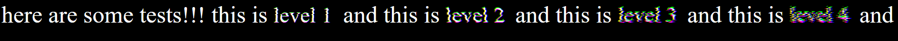

# glitch.js

Add glitch text to your webpage!!!



## How to use

1. Add `glitch.js` to your webpage
```html
<script src="glitch.js"></script>
```

2. Add class `glitch-n` where `n` is a positive integer indicating the level of glitchiness:
```html
<span class="glitch-1">Subtle glitch</span>
<span class="glitch-2">Moderate glitch</span>
<span class="glitch-3">Intense glitch</span>
<span class="glitch-4">Extreme glitch</span>
<span class="glitch-5">It goes on and on</span>
```
